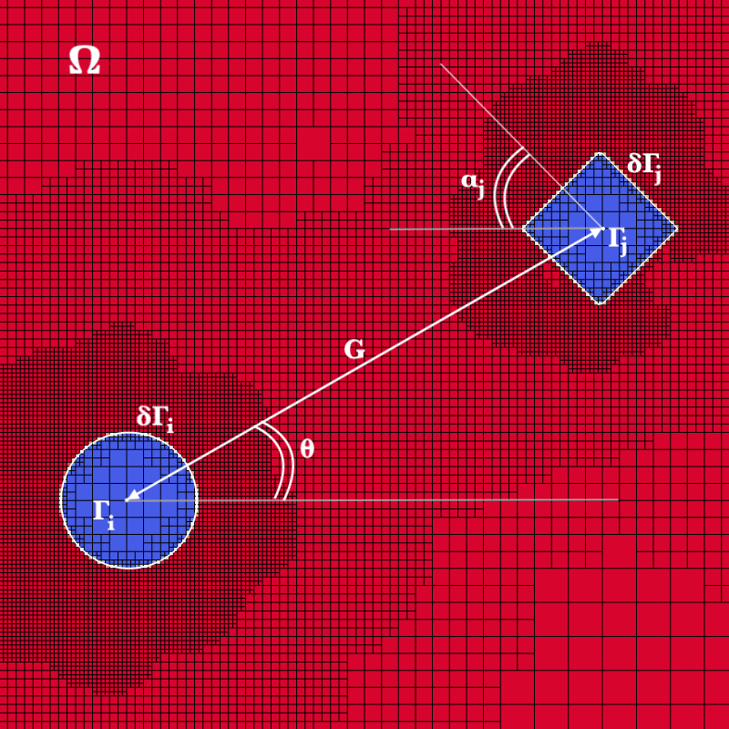

---
layout: page
title: Presentations
nav-menu: true
---

<!-- Main -->

  <!-- One -->
  <section id="one">
    

      <header class="major">
        <h1>Presentations</h1>
      </header>

      <!-- Content -->
      

        

          <h3>Hierarchical Machine Learning Modelling of Multiphase Flows,CHBE,UBC, 2024 </h3>
        

        

          <h3> Numerical Simulation of the Unbounded Flow Past a Non-spherical Obstacle,CHBE,UBC, 2023 </h3>
        

      

          <h3>Adaptive Octree-grid and Conservative Numerical Simulation of the Unbounded Flow Past  a Non-spherical Obstacle,  International Union of Theoretical and Applied Mechanics Symposium, Toulouse France, 2022 </h3>
        

        
     
        
        

          <h3>Modeling Blood: When Hopes Deteriorate, Model and Simulate,CHBE,UBC, 2022 </h3>
        

        
        

          <h3>Preparing a Winning Research Scholarhsip, CHBE,UBC, 2022</h3>
        

        

          <h3>Our Experience as Female Engineers in Training, Hall of Fame, UBC, 2022</h3>
        

        

          <h3>Graduate Student Council Introduction and Recruitment, Graduate Students Orientation,UBC,
2022</h3>
        

        

          <h3>Why Graduate School,Information Session, Envision Team, UBC, 2021</h3>
        

        

          <h3>What is a Union?, Faculty of Applied Science and Engineering, School of Landscape and Architecture,
UBC, 2020, 2021.
2022</h3>
        

          <h3>Promoting Graduate Studies, Canadian Graduate Engineering Consortium Virtual Fair, 2021</h3>
        

        

          <h3>Women in Engineering (WiE) Introduction and Recruitment , Imagine Day, Campus Community
Platform at Alma Mater Society, 2021>
        

        
        

        <!-- Break -->
        

          <h3>Machine Learning</h3>
        

      

      <header class="major">
        <h1>Publications</h1>
      </header>

      <dl>
        <dt>Binary Interactions between Stationary Circular and Non-circular Cylinders in Steady Unbounded Flow.</dt>
        <dd>
          

            
          

          <i><b>L. Jbara</b> and A. Wachs.</i> 
          <i>Journal of Fluid Mechanics, (Under Review)</i> 
        </dd>
      </dl>
      
      <dl>
        <dt>Steady Three-Dimensional Unbounded Flow Past an Obstacle Continuously Deviating from a Sphere to a Cube</dt>
        <dd>
          

            
          

          <i><b>L. Jbara</b> and A. Wachs.</i> 
          <i>Physics of Fluids, 35(1), Jan 2023.</i> 
          <a href="https://pubs.aip.org/aip/pof/article/35/1/013343/2867562/Steady-three-dimensional-unbounded-flow-past-an">[<b>Paper</b>]</a>
        </dd>
      </dl>
      

    

  </section>

