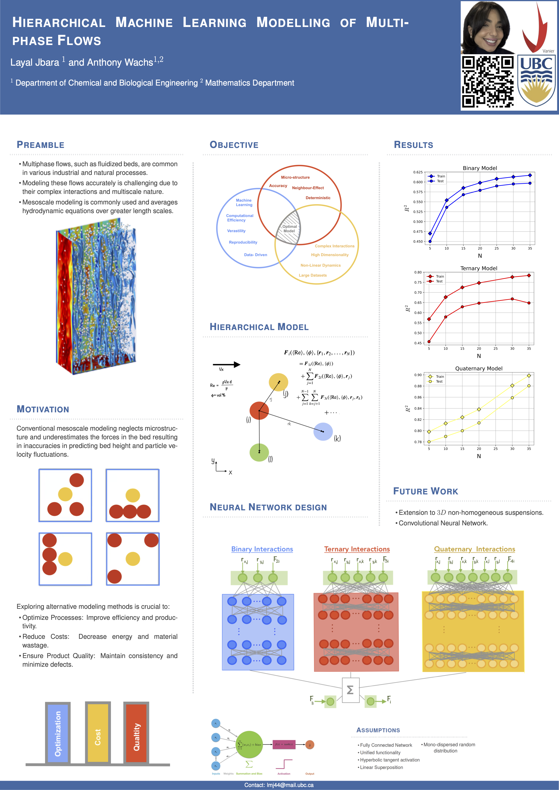
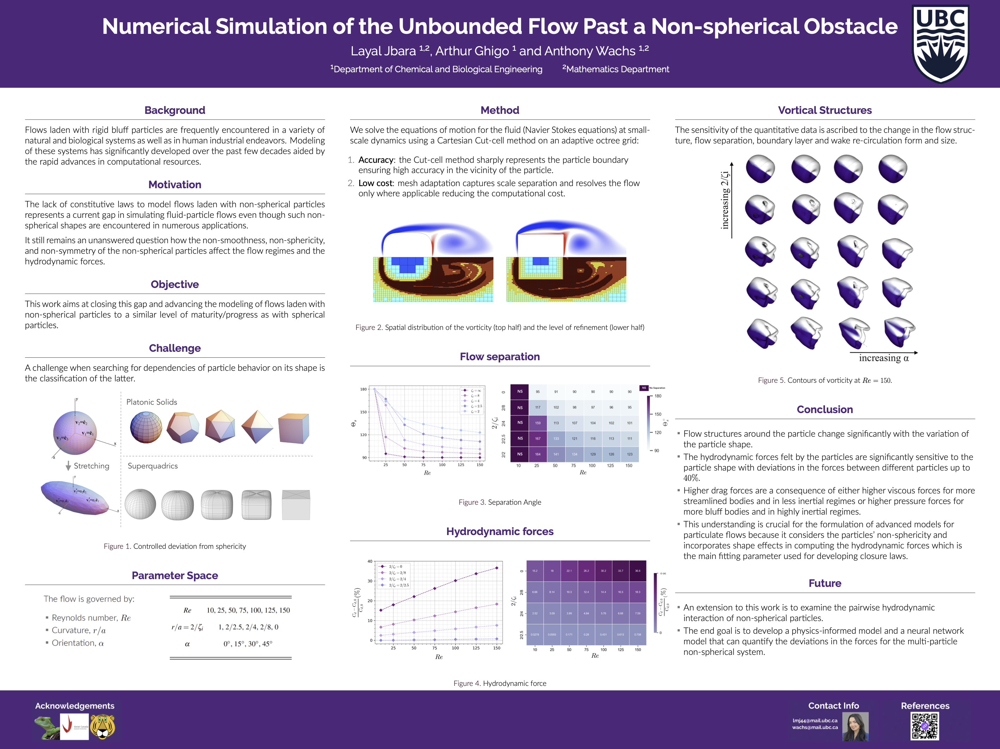

<!-- Main -->

  <!-- One -->
  <section id="one">
    

      <header class="major">
        <h1>Presentations</h1>
      </header>

      <dl>
        <dt>Hierarchical Machine Learning Modelling of Multiphase Flows</dt>
        <dd>
          

            
          

          <i><b>CHBE, UBC, 2024</b></i> 
        </dd>
      </dl>
      
      <dl>
        <dt>Numerical Simulation of the Unbounded Flow Past a Non-spherical Obstacle</dt>
        <dd>
          

            
          

          <i><b>CHBE, UBC, 2023</b></i> 
        </dd>
      </dl>
      
      <dl>
        <dt>Adaptive Octree-grid and Conservative Numerical Simulation of the Unbounded Flow Past a Non-spherical Obstacle</dt>
        <dd>
          

            

              <video width="400" controls>
                <source src="figures/mv3.mp4" type="video/mp4">
              </video>
            

            

              <video width="400" controls>
                <source src="figures/mv4.mp4" type="video/mp4">
              </video>
            

          

          <dd>UTAM, Toulouse, France, 2022</dd>
        </dd>
      </dl>
      
      <dl>
        <dt>3D, adaptive octree-grid and conservative numerical simulation of the unbounded flow past non-spherical obstacle</dt>
        <dd>
         

          

            <video width="400" controls>
              <source src="figures/mv1.mp4" type="video/mp4">
            </video>
          

          

            <video width="400" controls>
              <source src="figures/mv2.mp4" type="video/mp4">
            </video>
          

        

                 

          <dd>MATH, UBC, 2022</dd>
        </dd>
      </dl>
      
      
      <dl>
        <dt>Modeling Blood: When Hopes Deteriorate, Model and Simulate</dt>
        <dd>
          

            
          

          <dd>CHBE, UBC, 2022</dd>
        </dd>
      </dl>

     <dl>
        <dt>Preparing a Winning Research Scholarship</dt>
        <dd>
          <dd>CHBE, UBC, 2022</dd>
        </dd>
      </dl>

      <dl>
        <dt>Our Experience as Female Engineers in Training</dt>
        <dd>Hall of Fame, UBC, 2022</dd>
      </dl>

      <dl>
        <dt>Graduate Student Council Introduction and Recruitment</dt>
        <dd>Graduate Students Orientation, UBC, 2022</dd>
      </dl>

      <dl>
        <dt>Why Graduate School</dt>
        <dd>Information Session, Envision Team, UBC, 2021</dd>
      </dl>

      <dl>
        <dt>What is a Union?</dt>
        <dd>Faculty of Applied Science and Engineering, School of Landscape and Architecture, UBC, 2020, 2021, 2022</dd>
      </dl>

      <dl>
        <dt>Promoting Graduate Studies</dt>
        <dd>Canadian Graduate Engineering Consortium Virtual Fair, 2021</dd>
      </dl>

      <dl>
        <dt>Women in Engineering (WiE) Introduction and Recruitment</dt>
        <dd>Imagine Day, Campus Community Platform at Alma Mater Society, 2021</dd>
      </dl>
      
    

  </section>

