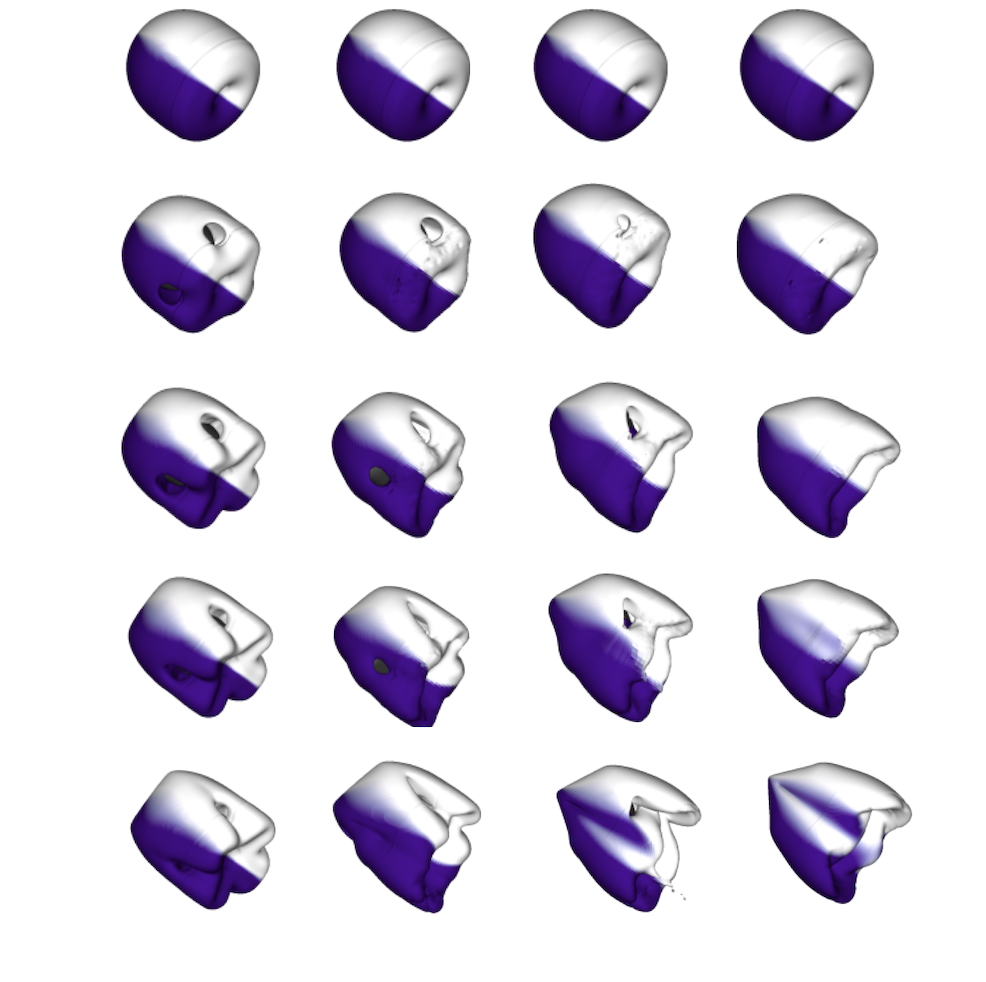

<!-- Main -->

  <!-- One -->
  <section id="one">
    

      <header class="major">
        <h1>Research interests</h1>
      </header>

      <!-- Content -->
      

        

          <h3>Computational Science</h3>
        

        

          <h3>Mathematical Modeling</h3>
        

        <!-- Break -->
        

          <h3>Machine Learning</h3>
        

      

      <header class="major">
        <h1>Publications</h1>
      </header>

      <dl>
        <dt>Steady Three-Dimensional Unbounded Flow Past an Obstacle Continuously Deviating from a Sphere to a Cube.?</dt>
        

          
          

        

        <i><b>L. Jbara</b> and A. Wachs.</i> 
        <i>Physics of Fluids, 35(1), Jan 2023. </i> 
        <i>We explain why.</i>
        <dt><a href="https://pubs.aip.org/aip/pof/article/35/1/013343/2867562/Steady-three-dimensional-unbounded-flow-past-an">[Paper]</a></dt>
      </dl>
    

  </section>

