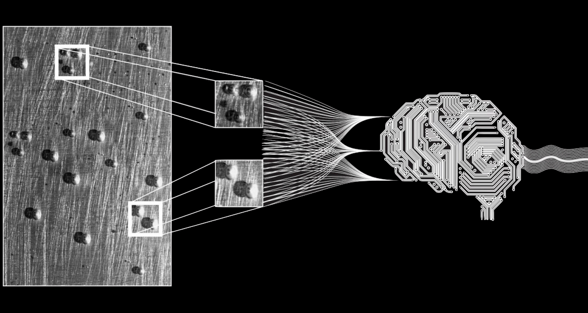
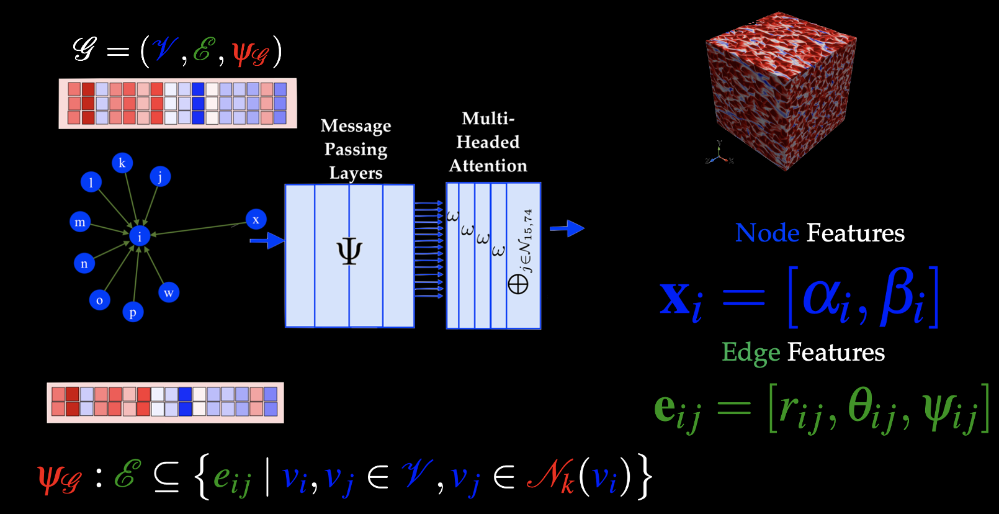
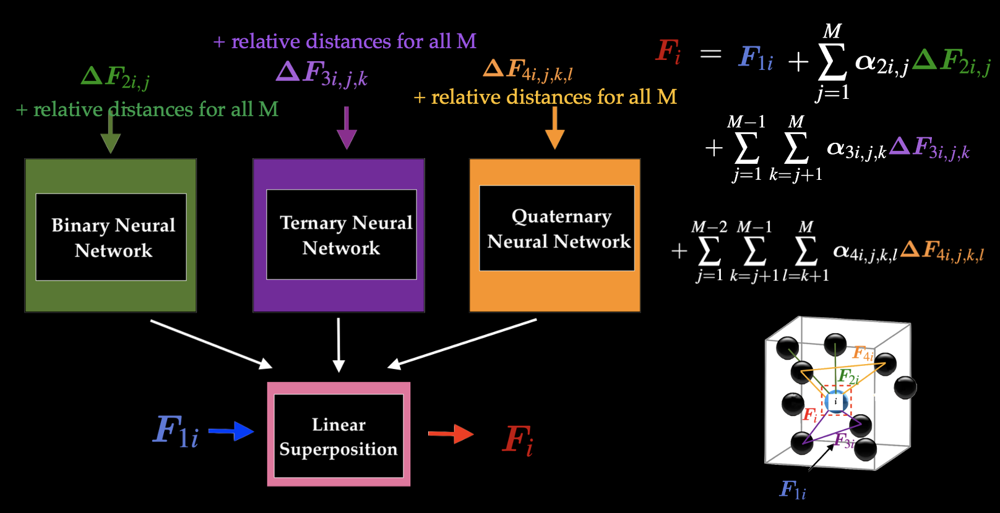

I am a final-semester Ph.D. candidate at the University of British Columbia, working under the supervision of Professor Anthony Wachs. I am deeply passionate about addressing complex scientific challenges that are not only computationally and data intensive but also interdisciplinary in nature. My focus lies in leveraging advanced computational techniques and data-driven methodologies to solve real-world problems with meaningful impact.  My current research work focuses on numerical simulations, computational fluid dynamics (CFD), high-performance computing (HPC), and machine learning. My work combines traditional CFD techniques with data-driven approaches to enhance predictive modeling and improve the efficiency of large-scale simulations. 

I thrive in environments that demand innovation, problem-solving, and interdisciplinary collaboration. I am committed to continuous learning and constantly seek opportunities that push me outside my comfort zone, allowing me to expand my skills and drive professional growth. If you're seeking a professional who can seamlessly integrate computational strategies with data-driven insights to drive impactful solutions, I would welcome the opportunity to connect.
  

## Machine Learning Models

I designed and implemented several ML models to develop high fidelity closures for the hydrodynamic interactions in fluid suspensions of particles, also known as particle-laden flows. These ML models incorporate advanced techniques, such as physics-inspired architectures, graph neural networks and attention mechanisms, to capture the multiscale and non-linear interactions between particles. By training on diverse data, the models are designed to generalize well to different flow conditions and particle configurations, making them adaptable to a variety of scenarios encountered in real-world applications. Through these models, we were able to significantly improve the prediction of variations in forces, that were not previously accounted for, achieving up to 95% accuracy in simpler cases.

### Attention-Based Graph Neural Networks

These types of flows are inherently characterized by irregularly structured data, where conventional grid-based representations often fail to capture the complexities and non-uniform relationships between particles. To address this, we propose the design of a Graph Neural Network (GNN), which is particularly well-suited for handling such irregular, graph-based data. The network is designed to leverage both node and edge features, which are dynamically constructed based on k-nearest neighborhoods. A key component of our GNN design is the use of message-passing layers, which facilitate the exchange of information between neighboring nodes. In each layer, nodes aggregate information from their neighbors, allowing the model to learn complex dependencies in the graph. Additionally, we incorporate multi-head attention mechanisms into the network. Attention mechanisms enable the model to weigh the importance of different neighbors when updating the node features The network is implemented, trained, and evaluated in Python using PyTorch and PyTorch Geometric. Training is performed on an NVIDIA Tesla V100 GPU mounted on the Sockeye supercomputer, a high-performance computing platform available at the University of British Columbia.

### A physics-inspired Hierarchical Neural Network

Interactions between particles in a fluid system can be of various orders: binary (involving two particles), ternary (involving three particles) and so on. These interactions play a crucial role in determining the behavior of the fluid and its properties. However, traditional models often simplify these interactions, typically focusing on unary and binary interactions, which may not capture the full complexity of the system. In this work, we propose and design a neural network architecture that goes beyond these simplified models by explicitly incorporating higher-order interactions, such as ternary and quaternary interactions, into its learning process. This model leverages the power of deep learning to capture complex, multiscale interactions in fluid systems, providing a more accurate representation of particle behavior. Moreover, we recognize that fluid systems often exhibit symmetries that can be leveraged to improve the model's performance and generalization. Therefore, our neural network design incorporates domain knowledge related to these symmetries.  The network is implemented, trained, and evaluated in Python using Tensorflow on the Cedar supercomputer at Digital Research Alliance of Canada.

